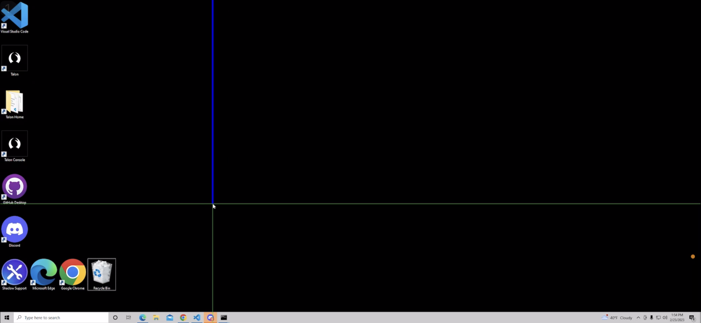

# Hissing Mouse

[](https://youtu.be/wwOJTt-4Gus)
[See demo video here](https://youtu.be/wwOJTt-4Gus)

This mouse pointer
is an attempt
to create the simplest possible
useful mouse pointer
that is controlled by your voice.

The most pointer will start moving 
when you start hissing.
The mouse pointer will stop moving
when you stop hissing.


Part of this simplicity of this mouse pointer
is that you do not control the direction.
Instead,
You will notice that the mouse pointer
makes a ninety degree turn to the right
every time you stop hissing.
What this means is that you can get to any place on the screen
in a series of right hand turns.


The idea for this mouse comes from
the fact that mail truck drivers
only make right hand turns
and are still able to deliver the mail to everyone in the town.

By default,
the crosshairs for the mouse pointer
appear when you start hissing
and disappear when you stop hissing
.
You can toggle them to show permanently
with the voice command:


```
toggle crosshairs
```

# Installation

This mouse depends on Talon (from [talonvoice.com](http://talonvoice.com) ) being installed on your computer.

Detailed installation videos for talon for all three major operating systems can be found on my [Talon Installation Playlis](https://youtube.com/playlist?list=PLOChdnCXLga7EapGx9lTIld7eBm1dEgeb)

This is a standalone set of files.  It does not depend on any other Talon script set.

Once you have Talon installed, put this set of files anywhere in the Talon User Directory.  

If you follow the installation instructions in the linked videos to download the knausj script set, simply repeat exactly what you did there with this room files. To summarize:

You can either do this the programmers way by cloning this repository into the Talon User Directory, or you can do this the non-programmers way by clicking on the green code button on this page, selecting download zip, opening your browser's downloads folder, and then dragging these files into the Talon user directly.  
at
To locate the Talon user directory, you right-click on the Talon icon in the system tray or bar of which ever operating system you are on, choose and the scripting option, choose the Open  Talon home option, and when that directly is open, choose the user directly and open it.  At that point you can drag and drop these files into that location.  As soon as you do, you can start hissing, and crosshairs will magically appear and the mouse will start moving.

# Known Issues

- This software is 'listening' for a very particular type of siblant hiss.  Keep trying, and this mouse will end up training you in about a day or two to produce exactly the kind of hit it is looking for. Hissing louder Will generally not make it work, so play with the sound of your hiss until you hit exactly thr right siblant. 
- This will only work on one screen.
- If you have the hissing noise mapped to any other command, this will probably conflict with whatever mapping you have.
